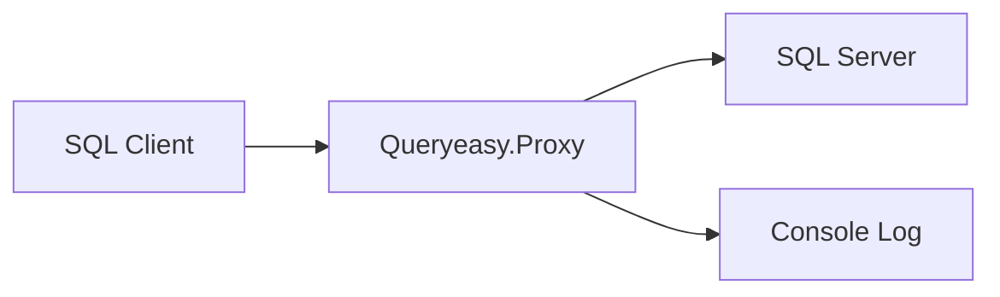

# Queryeasy

Queryeasy - это локальный TCP-прокси для Microsoft SQL Server, работающий на уровне TDS (Tabular Data Stream). Проект принимает подключения SQL-клиентов на локальном адресе, перенаправляет трафик на реальный SQL Server и позволяет инспектировать клиентские TDS-пакеты, логировать SQL-запросы и при необходимости переписывать SQL Batch перед отправкой на сервер.

Проект полезен для разработки, отладки и экспериментов с SQL-трафиком, когда нужно увидеть, какие запросы отправляет приложение, проверить поведение клиента при измененном SQL или безопасно протестировать правила переписывания в режиме dry run.

## Возможности

- Принимает TCP-подключения от SQL-клиентов и проксирует их на целевой SQL Server.
- Логирует TDS-пакеты в направлении `client -> sql`.
- Декодирует и логирует SQL Batch.
- Инспектирует RPC Request и показывает Unicode-preview для кандидатов на `sp_executesql`.
- Поддерживает правила переписывания SQL Batch через `Contains` или `Regex`.
- Позволяет запускать rewrite в режиме `DryRun`, чтобы увидеть совпадения без изменения трафика.
- Умеет пытаться отключить TDS-шифрование на этапе PreLogin, если это разрешено клиентом и сервером.
- При обнаружении raw TLS может перейти в обычное байтовое проксирование или завершить сессию в fail-closed режиме.

## Статус проекта

Текущая версия - один консольный проект .NET:

```text
Queryeasy/
├── Queryeasy.Proxy/
│   ├── Program.cs
│   ├── ProxyOptions.cs
│   ├── ProxySession.cs
│   ├── SqlProxyServer.cs
│   ├── appsettings.json
│   ├── appsettings.Production.json
│   ├── Rewrite/
│   └── Tds/
├── Queryeasy.Proxy.Tests/
└── tools/
```

В репозитории нет `.sln`-файла. Сборка, запуск и тесты выполняются напрямую через `.csproj`.

## Требования

- .NET SDK с поддержкой `net10.0`.
- Доступный Microsoft SQL Server.
- SQL-клиент или приложение, которое можно направить на адрес прокси.

По умолчанию прокси слушает `127.0.0.1:11433` и перенаправляет трафик на `127.0.0.1:1433`.

## Быстрый старт

Сборка проекта:

```powershell
dotnet build .\Queryeasy.Proxy\Queryeasy.Proxy.csproj
```

Запуск с конфигурацией по умолчанию:

```powershell
dotnet run --project .\Queryeasy.Proxy\Queryeasy.Proxy.csproj
```

После запуска в консоли появится сообщение вида:

```text
MSSQL proxy listening on 127.0.0.1:11433, forwarding to 127.0.0.1:1433.
Press Ctrl+C to stop.
```

Теперь SQL-клиент нужно подключать не к SQL Server напрямую, а к адресу прокси:

```text
Server=127.0.0.1,11433
```

Прокси установит отдельное соединение с реальным SQL Server по адресу `TargetHost:TargetPort` из конфигурации.

Остановка выполняется через `Ctrl+C`.

## Запуск с другим конфигом

Путь к JSON-конфигурации можно передать первым аргументом:

```powershell
dotnet run --project .\Queryeasy.Proxy\Queryeasy.Proxy.csproj -- .\Queryeasy.Proxy\appsettings.PassThrough.json
```

Или:

```powershell
dotnet run --project .\Queryeasy.Proxy\Queryeasy.Proxy.csproj -- .\Queryeasy.Proxy\appsettings.RequirePlainText.json
```

Если аргумент не передан, приложение ищет `appsettings.json` сначала в текущей рабочей директории, затем рядом с собранным исполняемым файлом.

Если файл конфигурации не найден или в нем нет секции `Proxy`, приложение запускается со значениями по умолчанию.

## Публикация

Опубликовать Release-сборку можно командой:

```powershell
dotnet publish .\Queryeasy.Proxy\Queryeasy.Proxy.csproj -c Release
```

Запуск опубликованного приложения:

```powershell
.\Queryeasy.Proxy.exe
```

Запуск опубликованного приложения с явным конфигом:

```powershell
.\Queryeasy.Proxy.exe .\appsettings.json
```

Важно: в `.csproj` настроено автоматическое копирование только `appsettings.json`. Файлы `appsettings.PassThrough.json` и `appsettings.RequirePlainText.json` нужно передавать из исходной директории, копировать рядом с exe вручную или добавить отдельное правило копирования.

## Конфигурация

Основной файл конфигурации:

```text
Queryeasy.Proxy/appsettings.json
```

Структура файла:

```json
{
  "Proxy": {
    "ListenHost": "127.0.0.1",
    "ListenPort": 11433,
    "TargetHost": "127.0.0.1",
    "TargetPort": 1433,
    "ConnectTimeoutSeconds": 10,
    "IdleTimeoutMinutes": 30,
    "BufferSizeBytes": 81920,
    "Mode": "InspectOnly",
    "LogPayloadPreview": true,
    "LogSqlText": true,
    "LogRewriteSqlText": false,
    "PayloadPreviewBytes": 64,
    "MaxSqlLogChars": 4000,
    "RewriteFailureBehavior": "FailOpen",
    "PreLoginEncryptionMode": "TryDisable",
    "FailIfEncryptionRequired": false,
    "LogPreLoginOptions": true
  },
  "RewriteRules": []
}
```

JSON-поля десериализуются без учета регистра. Enum-значения задаются строками.

### Proxy

| Параметр | Значение по умолчанию | Описание |
| --- | --- | --- |
| `ListenHost` | `127.0.0.1` | Хост или IP-адрес, на котором прокси принимает подключения клиентов. |
| `ListenPort` | `11433` | TCP-порт прокси. |
| `TargetHost` | `127.0.0.1` | Хост или IP-адрес реального SQL Server. |
| `TargetPort` | `1433` | TCP-порт реального SQL Server. |
| `ConnectTimeoutSeconds` | `10` | Таймаут подключения к целевому SQL Server. |
| `IdleTimeoutMinutes` | `30` | Таймаут простоя чтения в сессии. |
| `BufferSizeBytes` | `81920` | Размер буфера для raw byte forwarding. Минимум - `4096`. |
| `Mode` | `InspectOnly` | Основной режим работы прокси. |
| `LogPayloadPreview` | `true` | Логировать hex-preview payload для TDS-пакетов. |
| `LogSqlText` | `true` | Логировать декодированный SQL-текст. |
| `LogRewriteSqlText` | `false` | Логировать SQL после применения rewrite-правила. |
| `PayloadPreviewBytes` | `64` | Сколько байт payload показывать в preview. `0` отключает preview. |
| `MaxSqlLogChars` | `4000` | Максимальная длина SQL-текста в логе. `0` отключает усечение. |
| `RewriteFailureBehavior` | `FailOpen` | Что делать при ошибке rewrite. |
| `PreLoginEncryptionMode` | `TryDisable` | Как обрабатывать TDS PreLogin ENCRYPTION. |
| `FailIfEncryptionRequired` | `false` | Завершать сессию, если после PreLogin обнаружен raw TLS. |
| `LogPreLoginOptions` | `true` | Логировать значение ENCRYPTION в PreLogin-пакетах клиента и сервера. |

Проверка конфигурации выполняется при запуске. Порты должны быть в диапазоне `0..65535`, хосты не должны быть пустыми, таймауты должны быть больше нуля, `BufferSizeBytes` должен быть не меньше `4096`, а `PayloadPreviewBytes` и `MaxSqlLogChars` не должны быть отрицательными.

## Режимы работы

### InspectOnly

Режим по умолчанию. Прокси анализирует клиентский TDS-трафик, логирует пакеты и SQL Batch, но отправляет SQL Server исходные пакеты без изменений.

### ForwardOnly

Значение присутствует в enum `ProxyMode`, но в текущей реализации отдельной ветки для него нет. На практике оно ведет себя как режим без rewrite: SQL Batch не переписывается, пакеты пересылаются дальше после обработки pipeline.

### DryRun

Прокси применяет правила rewrite к декодированному SQL Batch только для проверки. Если правило совпало, это логируется, но на SQL Server отправляется исходный SQL.

Используйте этот режим перед `Rewrite`, чтобы убедиться, что правила срабатывают на нужных запросах.

### Rewrite

Прокси применяет первое включенное правило, которое реально изменило SQL Batch, пересобирает TDS-пакеты и отправляет на SQL Server измененный SQL.

Rewrite применяется только к TDS message type `SqlBatch`. RPC Request сейчас только инспектируется и пересылается без изменений.

## Поведение при ошибке rewrite

`RewriteFailureBehavior` определяет, что делать при ошибке правила, например при некорректном regex:

| Значение | Поведение |
| --- | --- |
| `FailOpen` | Ошибка логируется, на SQL Server отправляется исходный SQL. |
| `FailClosed` | Сессия завершается ошибкой, исходный SQL не отправляется дальше. |

## PreLogin и шифрование

SQL-инспекция и rewrite требуют plaintext TDS. Если клиент и сервер переходят на TLS, SQL-текст становится недоступен прокси.

`PreLoginEncryptionMode` управляет обработкой ENCRYPTION-опции в TDS PreLogin:

| Значение | Поведение |
| --- | --- |
| `PassThrough` | PreLogin пересылается без попытки изменить ENCRYPTION. Если `LogPreLoginOptions` выключен, PreLogin вообще не обрабатывается специальной логикой. |
| `TryDisable` | Прокси пытается заменить ENCRYPTION на `EncryptNotSupported` в PreLogin-пакетах клиента и сервера. Если после этого все равно начинается raw TLS, прокси переходит в байтовое проксирование. |
| `RequirePlainText` | Прокси также выставляет `EncryptNotSupported`, но при обнаружении raw TLS завершает сессию ошибкой. |

Дополнительный флаг `FailIfEncryptionRequired` включает fail-closed поведение при raw TLS независимо от выбранного `PreLoginEncryptionMode`.

В репозитории есть два готовых варианта конфигурации:

- `Queryeasy.Proxy/appsettings.PassThrough.json` - оставляет PreLogin ENCRYPTION без изменений.
- `Queryeasy.Proxy/appsettings.RequirePlainText.json` - требует plaintext TDS и завершает сессию, если клиент или сервер все равно включили TLS.

## RewriteRules

Правила rewrite задаются массивом `RewriteRules` в корне JSON-конфигурации:

```json
{
  "RewriteRules": [
    {
      "Name": "UseViewInsteadOfTable",
      "Enabled": true,
      "MatchType": "Contains",
      "Find": "FROM dbo.SomeTable",
      "Replace": "FROM dbo.SomeView",
      "IgnoreCase": true
    }
  ]
}
```

Поля правила:

| Поле | Значение по умолчанию | Описание |
| --- | --- | --- |
| `Name` | `Unnamed` | Имя правила, которое выводится в логах. |
| `Enabled` | `true` | Включает или отключает правило. |
| `MatchType` | `Contains` | Тип поиска: `Contains` или `Regex`. |
| `Find` | пустая строка | Что искать в SQL. Пустое значение пропускается. |
| `Replace` | пустая строка | На что заменить найденный фрагмент. |
| `IgnoreCase` | `true` | Игнорировать регистр при поиске. |

Правила обрабатываются по порядку. Возвращается первое включенное правило, которое изменило SQL. Если правило не изменило строку, проверяется следующее.

### Contains

`Contains` использует обычную строковую замену:

```json
{
  "Name": "RedirectOrders",
  "Enabled": true,
  "MatchType": "Contains",
  "Find": "FROM dbo.Orders",
  "Replace": "FROM dbo.Orders_Debug",
  "IgnoreCase": true
}
```

При `IgnoreCase: true` поиск выполняется без учета регистра.

### Regex

`Regex` использует регулярные выражения .NET с таймаутом 1 секунда:

```json
{
  "Name": "ForceTop100",
  "Enabled": true,
  "MatchType": "Regex",
  "Find": "^\\s*SELECT\\s+",
  "Replace": "SELECT TOP (100) ",
  "IgnoreCase": true
}
```

Для regex включается `RegexOptions.CultureInvariant`; при `IgnoreCase: true` дополнительно включается `RegexOptions.IgnoreCase`.

## Пример конфигурации для DryRun

```json
{
  "Proxy": {
    "ListenHost": "127.0.0.1",
    "ListenPort": 11433,
    "TargetHost": "127.0.0.1",
    "TargetPort": 1433,
    "Mode": "DryRun",
    "LogSqlText": true,
    "LogRewriteSqlText": true,
    "PreLoginEncryptionMode": "TryDisable",
    "RewriteFailureBehavior": "FailOpen"
  },
  "RewriteRules": [
    {
      "Name": "UseDebugView",
      "Enabled": true,
      "MatchType": "Contains",
      "Find": "FROM dbo.Users",
      "Replace": "FROM dbo.Users_Debug",
      "IgnoreCase": true
    }
  ]
}
```

В этом режиме прокси покажет, что правило совпало, но отправит на SQL Server исходный запрос.

## Пример конфигурации для Rewrite

```json
{
  "Proxy": {
    "ListenHost": "127.0.0.1",
    "ListenPort": 11433,
    "TargetHost": "127.0.0.1",
    "TargetPort": 1433,
    "Mode": "Rewrite",
    "LogSqlText": true,
    "LogRewriteSqlText": true,
    "PreLoginEncryptionMode": "RequirePlainText",
    "FailIfEncryptionRequired": true,
    "RewriteFailureBehavior": "FailClosed"
  },
  "RewriteRules": [
    {
      "Name": "ReplaceTable",
      "Enabled": true,
      "MatchType": "Contains",
      "Find": "FROM dbo.SourceTable",
      "Replace": "FROM dbo.ReplacementView",
      "IgnoreCase": true
    }
  ]
}
```

Такой вариант лучше подходит для сценариев, где важно не пропустить запрос без rewrite, если plaintext TDS недоступен или правило сломалось.

## Как это работает

Высокоуровневый поток данных:



Основные компоненты:

- `Program.cs` выбирает файл конфигурации, загружает `ProxyOptions`, валидирует настройки и запускает сервер до `Ctrl+C`.
- `SqlProxyServer.cs` поднимает `TcpListener`, принимает клиентские подключения и создает отдельную сессию для каждого клиента.
- `ProxySession.cs` подключается к целевому SQL Server, выполняет PreLogin-обработку, запускает две задачи копирования и считает байты по завершении сессии.
- `Tds/PreLogin/TdsPreLoginNegotiator.cs` читает PreLogin-пакеты клиента и сервера, логирует ENCRYPTION и при необходимости меняет его на `EncryptNotSupported`.
- `Tds/TdsClientToServerPipeline.cs` обрабатывает поток `client -> sql`: читает TDS-пакеты, собирает многофрагментные сообщения, логирует SQL Batch, инспектирует RPC и применяет rewrite.
- `Rewrite/SqlRewriter.cs` применяет включенные правила rewrite по порядку.
- Поток `sql -> client` сейчас копируется как байты без TDS-инспекции.

## Что логируется

Для каждой сессии создается короткий идентификатор, например `[a1b2c3d4]`. Он используется во всех сообщениях этой сессии.

В логах можно увидеть:

- подключение клиента;
- подключение к SQL Server;
- PreLogin ENCRYPTION до и после обработки;
- тип TDS-пакета, status, length и packetId;
- hex-preview payload;
- SQL Batch;
- результат совпадения rewrite-правила;
- Unicode-preview для RPC Request с возможным `sp_executesql`;
- закрытие сессии и количество переданных байтов.

Управление подробностью логов выполняется через `LogPayloadPreview`, `PayloadPreviewBytes`, `LogSqlText`, `LogRewriteSqlText` и `MaxSqlLogChars`.

## Ограничения

- Rewrite работает только для `SqlBatch`. RPC Request, включая `sp_executesql`, сейчас только инспектируется.
- SQL-текст виден только при plaintext TDS. Если начинается raw TLS, прокси не может декодировать или переписывать SQL.
- В направлении `sql -> client` трафик копируется без инспекции и изменения.
- `ForwardOnly` есть в enum, но не имеет отдельного специализированного пути выполнения.
- В репозитории нет автоматических тестов.
- В репозитории нет `.sln`; команды сборки должны ссылаться на `.csproj`.
- Альтернативные конфиги `appsettings.PassThrough.json` и `appsettings.RequirePlainText.json` не копируются в output автоматически.
- Проект не добавляет аутентификацию, авторизацию или TLS-терминацию. Это диагностический прокси, а не защитный шлюз.

## Troubleshooting

### Порт прокси уже занят

Если `ListenPort` занят, измените `ListenPort` в конфигурации или остановите процесс, который уже слушает этот порт.

### SQL Server недоступен

Проверьте `TargetHost`, `TargetPort`, сетевую доступность SQL Server и значение `ConnectTimeoutSeconds`. В логах сессии будет видно, что прокси пытается подключиться к целевому серверу.

### SQL не появляется в логах

Наиболее частая причина - соединение перешло на TLS. Проверьте сообщения про PreLogin и raw TLS. Для попытки получить plaintext TDS используйте `PreLoginEncryptionMode: "TryDisable"`. Если нужно строго запретить TLS, используйте `RequirePlainText` вместе с `FailIfEncryptionRequired: true`.

### Rewrite-правило не срабатывает

Проверьте:

- что `Mode` установлен в `DryRun` или `Rewrite`;
- что правило имеет `Enabled: true`;
- что `Find` не пустой;
- что SQL приходит как `SqlBatch`, а не только как RPC Request;
- что регистр и пробелы соответствуют правилу или включен `IgnoreCase`;
- что соединение не ушло в raw TLS.

### Regex-правило завершает сессию

Если `RewriteFailureBehavior` установлен в `FailClosed`, ошибка regex завершит сессию. Для диагностики можно временно поставить `FailOpen`, исправить выражение и проверить поведение в `DryRun`.

### Альтернативный конфиг не найден после publish

По умолчанию копируется только `appsettings.json`. Передайте путь к нужному конфигу явно или скопируйте файл рядом с опубликованным exe.

## Рекомендованный порядок проверки rewrite

1. Запустите прокси в `InspectOnly` и убедитесь, что SQL Batch виден в логах.
2. Добавьте правило в `RewriteRules`, включите `DryRun` и проверьте, что правило совпадает с нужными запросами.
3. Включите `LogRewriteSqlText`, чтобы увидеть итоговый SQL.
4. Переключите `Mode` на `Rewrite`.
5. Для критичных сценариев используйте `PreLoginEncryptionMode: "RequirePlainText"`, `FailIfEncryptionRequired: true` и `RewriteFailureBehavior: "FailClosed"`.

## Безопасность

Queryeasy выводит SQL-текст в консоль. SQL-запросы могут содержать персональные данные, токены, параметры поиска, фрагменты бизнес-данных или другую чувствительную информацию.

Не запускайте прокси с подробным логированием в средах, где такие данные нельзя сохранять в консольный вывод, терминальные логи или системы сбора логов.

## Разработка

Полезные команды:

```powershell
dotnet build .\Queryeasy.Proxy\Queryeasy.Proxy.csproj
dotnet run --project .\Queryeasy.Proxy\Queryeasy.Proxy.csproj
dotnet publish .\Queryeasy.Proxy\Queryeasy.Proxy.csproj -c Release
```

## Production hardening

Для production-like запуска используйте `Queryeasy.Proxy/appsettings.Production.json` как отправную точку:

```powershell
dotnet run --project .\Queryeasy.Proxy\Queryeasy.Proxy.csproj -- .\Queryeasy.Proxy\appsettings.Production.json
```

Ключевые значения в production-конфиге:

```json
"Mode": "DryRun",
"RewriteFailureBehavior": "FailOpen",
"LogPayloadPreview": false,
"LogSqlText": false,
"LogRewriteSqlText": false,
"LogLevel": "Info",
"MaxConcurrentSessions": 500,
"MaxInspectableMessageBytes": 1048576,
"MaxRewriteSqlChars": 65536
```

Перед переключением на `Rewrite` прогоните правила в `DryRun` и проверьте метрики в summary-логах. Подробное SQL/payload логирование в production лучше включать только временно и точечно.

### Load harness

В `tools/load-harness.ps1` есть простой PowerShell 7 сценарий для сравнения прямого подключения и подключения через прокси:

```powershell
pwsh .\tools\load-harness.ps1 `
  -ConnectionString "Server=127.0.0.1,11433;Database=testdb;Integrated Security=true;TrustServerCertificate=true" `
  -Query "SELECT 1" `
  -Concurrency 16 `
  -IterationsPerWorker 100
```

Сравните результаты для:

- прямого подключения к SQL Server;
- прокси в `ForwardOnly`;
- прокси в `InspectOnly`;
- прокси в `Rewrite`.

Так как тестовый проект появился, базовая автоматическая проверка:

```powershell
dotnet test .\Queryeasy.Proxy.Tests\Queryeasy.Proxy.Tests.csproj
```

Базовая ручная проверка выглядит так:

1. Запустить SQL Server на `TargetHost:TargetPort`.
2. Запустить Queryeasy.
3. Подключить SQL-клиент к `ListenHost:ListenPort`.
4. Выполнить простой SQL Batch, например `SELECT 1`.
5. Проверить, что в консоли появились TDS-пакеты и SQL Batch.
6. При необходимости включить `DryRun` или `Rewrite` и проверить правила.
