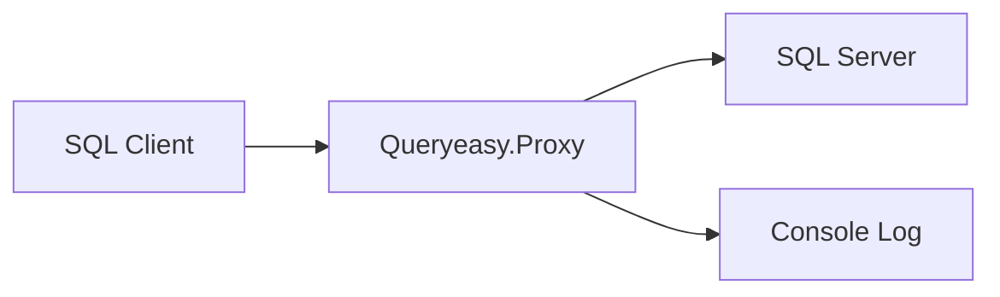
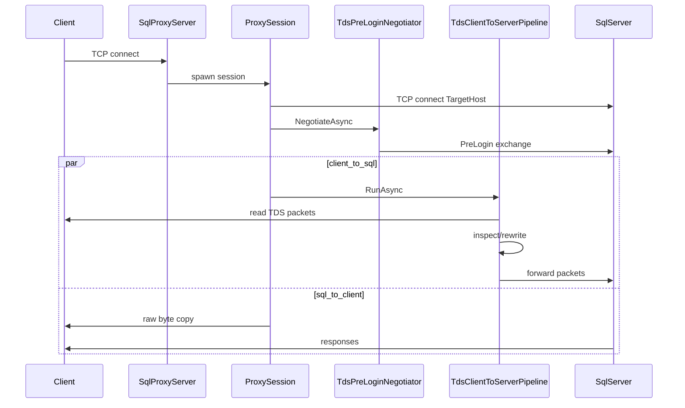
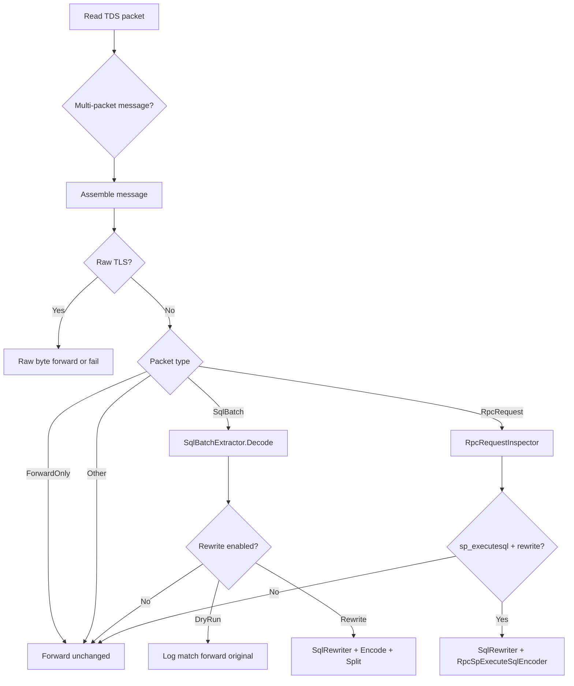

# Архитектура

> **Для кого:** разработчик  
> **Время чтения:** ~12 мин  
> **Что узнаете:** компоненты Queryeasy, поток данных и ограничения системы.

## Высокоуровневая схема

Queryeasy — консольное .NET 10 приложение без внешних NuGet-зависимостей (кроме SDK). Весь код — в одном проекте [Queryeasy.Proxy](../Queryeasy.Proxy/) с двумя основными подсистемами: **Tds/** (протокол) и **Rewrite/** (правила).

## Жизненный цикл сессии

### Шаги

1. **Accept** — [SqlProxyServer](../Queryeasy.Proxy/SqlProxyServer.cs) принимает TCP, ограничивает concurrency через `SemaphoreSlim`, создаёт 8-символьный session id.
2. **Connect upstream** — [ProxySession](../Queryeasy.Proxy/ProxySession.cs) подключается к `TargetHost:TargetPort` с `ConnectTimeout`.
3. **PreLogin** — [TdsPreLoginNegotiator](../Queryeasy.Proxy/Tds/PreLogin/TdsPreLoginNegotiator.cs) может изменить ENCRYPTION.
4. **Параллельный relay:**
   - **client → sql:** [TdsClientToServerPipeline](../Queryeasy.Proxy/Tds/TdsClientToServerPipeline.cs)
   - **sql → client:** `CopyUntilClosedAsync` — **без** TDS-инспекции
5. **Завершение** — первая завершившаяся задача отменяет вторую; byte counters → [ProxyMetrics](../Queryeasy.Proxy/ProxyMetrics.cs).

## Компоненты и ответственность

| Компонент | Файл | Ответственность |
| --- | --- | --- |
| Entry | [Program.cs](../Queryeasy.Proxy/Program.cs) | Config path, load/validate options, logging, Ctrl+C, run server |
| Server | [SqlProxyServer.cs](../Queryeasy.Proxy/SqlProxyServer.cs) | `TcpListener`, session limit, metrics summary |
| Session | [ProxySession.cs](../Queryeasy.Proxy/ProxySession.cs) | Upstream connect, PreLogin, bidirectional copy |
| Options | [ProxyOptions.cs](../Queryeasy.Proxy/ProxyOptions.cs) | JSON model, validation, `InspectionCapabilities` |
| Capabilities | [InspectionCapabilities.cs](../Queryeasy.Proxy/InspectionCapabilities.cs) | Флаги inspect/rewrite по mode и rules |
| Metrics | [ProxyMetrics.cs](../Queryeasy.Proxy/ProxyMetrics.cs) | Thread-safe counters |
| Log | [ProxyLog.cs](../Queryeasy.Proxy/ProxyLog.cs) | Leveled logging, optional async channel |
| Task cleanup | [TaskObservation.cs](../Queryeasy.Proxy/TaskObservation.cs) | Graceful task completion on cancel |

### TDS layer (`Tds/`)

| Компонент | Файл | Ответственность |
| --- | --- | --- |
| Pipeline | [TdsClientToServerPipeline.cs](../Queryeasy.Proxy/Tds/TdsClientToServerPipeline.cs) | Read packets, assemble messages, route by type, inspect/rewrite |
| Reader/Writer | [TdsPacketReader.cs](../Queryeasy.Proxy/Tds/TdsPacketReader.cs), [TdsPacketWriter.cs](../Queryeasy.Proxy/Tds/TdsPacketWriter.cs) | I/O TDS packets |
| Model | [TdsPacket.cs](../Queryeasy.Proxy/Tds/TdsPacket.cs), [TdsPacketType.cs](../Queryeasy.Proxy/Tds/TdsPacketType.cs) | Packet model |
| Splitter | [TdsPacketSplitter.cs](../Queryeasy.Proxy/Tds/TdsPacketSplitter.cs) | Split rewritten payload into packets |
| SQL Batch | [SqlBatchExtractor.cs](../Queryeasy.Proxy/Tds/SqlBatchExtractor.cs) | Decode/encode SQL Batch Unicode text |
| RPC inspect | [RpcRequestInspector.cs](../Queryeasy.Proxy/Tds/RpcRequestInspector.cs) | Parse RPC; full parse for `sp_executesql` |
| RPC encode | [RpcSpExecuteSqlEncoder.cs](../Queryeasy.Proxy/Tds/RpcSpExecuteSqlEncoder.cs) | Re-encode modified `sp_executesql` |
| Parameters | [SpExecuteSqlParameterHelper.cs](../Queryeasy.Proxy/Tds/SpExecuteSqlParameterHelper.cs) | Parse `@params`, resolve by name |
| DateTime2 | [TdsDateTime2Helper.cs](../Queryeasy.Proxy/Tds/TdsDateTime2Helper.cs) | Binary encode/decode datetime2 scales |
| TLS signal | [RawTlsDetectedException.cs](../Queryeasy.Proxy/Tds/RawTlsDetectedException.cs) | Detect TLS instead of TDS |

### PreLogin (`Tds/PreLogin/`)

| Компонент | Файл |
| --- | --- |
| Negotiator | [TdsPreLoginNegotiator.cs](../Queryeasy.Proxy/Tds/PreLogin/TdsPreLoginNegotiator.cs) |
| Parser | [TdsPreLoginParser.cs](../Queryeasy.Proxy/Tds/PreLogin/TdsPreLoginParser.cs) |
| Mode enum | [PreLoginEncryptionMode.cs](../Queryeasy.Proxy/Tds/PreLogin/PreLoginEncryptionMode.cs) |

### Rewrite engine (`Rewrite/`)

| Компонент | Файл | Ответственность |
| --- | --- | --- |
| Rewriter | [SqlRewriter.cs](../Queryeasy.Proxy/Rewrite/SqlRewriter.cs) | Apply rules in order |
| Rule config | [SqlRewriteRule.cs](../Queryeasy.Proxy/Rewrite/SqlRewriteRule.cs) | JSON rule model |
| Compiled rule | [CompiledSqlRewriteRule.cs](../Queryeasy.Proxy/Rewrite/CompiledSqlRewriteRule.cs) | Pre-compiled regex (1s timeout) |
| Condition | [SqlRewriteCondition.cs](../Queryeasy.Proxy/Rewrite/SqlRewriteCondition.cs) | When filters |
| Action | [SqlRewriteAction.cs](../Queryeasy.Proxy/Rewrite/SqlRewriteAction.cs) | ReplaceSql, SetParameterValue, SetParameterType |
| Result | [RewriteResult.cs](../Queryeasy.Proxy/Rewrite/RewriteResult.cs) | Output: changed SQL, parameter changes, errors |

## Поток client → sql (детально)

## Архитектурные паттерны

| Паттерн | Применение |
| --- | --- |
| TCP reverse proxy | Accept → upstream connect → bidirectional relay |
| Pipeline / handler | `TdsClientToServerPipeline` маршрутизирует по `TdsPacketType` |
| Strategy by mode | `ProxyMode` + `InspectionCapabilities` |
| Rule engine | JSON → `CompiledSqlRewriteRule` → `SqlRewriter` |
| Fail-open / fail-closed | `RewriteFailureBehavior`, `FailIfEncryptionRequired` |
| Resource pooling | `ArrayPool<byte>` для буферов |
| Concurrency control | `SemaphoreSlim`, fire-and-forget session tasks |
| Async I/O | `NetworkStream` throughout |
| Config as code | `ProxyOptions` record + startup validation |
| InternalsVisibleTo | [AssemblyInfo.cs](../Queryeasy.Proxy/Properties/AssemblyInfo.cs) — тесты видят internal API |

## Ограничения системы

- RPC rewrite **только** для `sp_executesql`.
- SQL виден только при **plaintext TDS** (нет TLS termination).
- Inspect/rewrite только **client → sql**; **sql → client** — raw copy.
- Нет `.sln` в репозитории.
- Unit-тесты не заменяют end-to-end с реальным SQL Server.
- `appsettings.PassThrough.json` / `RequirePlainText.json` не копируются в output автоматически.
- Нет authentication, authorization, TLS termination — диагностический прокси, не security gateway.

## См. также

- [Разработка](development.md) — тесты и точки расширения
- [Глоссарий](glossary.md)
- [Шифрование и PreLogin](encryption-and-prelogin.md)
