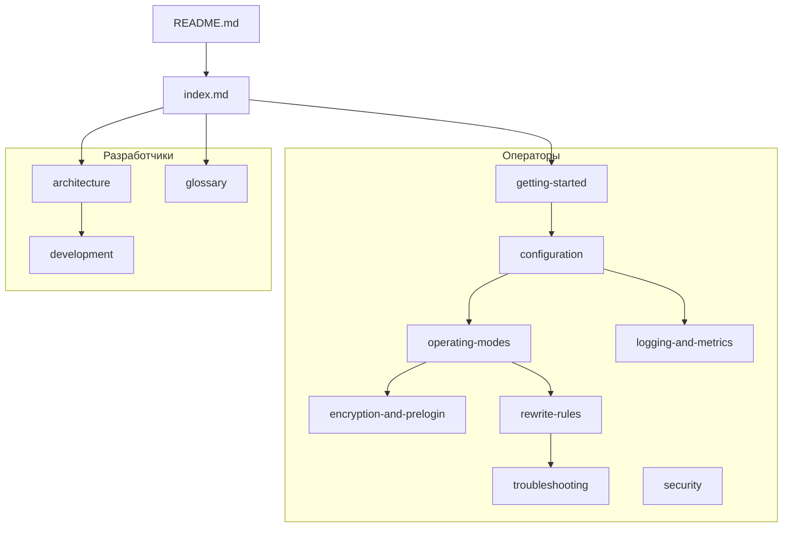

# Документация Queryeasy

Queryeasy — локальный TCP-прокси для Microsoft SQL Server на уровне TDS. Эта документация описывает установку, конфигурацию, режимы работы, правила rewrite и внутреннее устройство проекта.

## Возможности

- TCP-проксирование клиент → SQL Server с настраиваемыми адресами и лимитами сессий.
- Логирование TDS-пакетов (client → sql) с управляемым `LogLevel`.
- Decode SQL Batch и RPC `sp_executesql` (statement, `@params`, значения).
- Правила rewrite для SQL Batch и RPC `sp_executesql` (текст, значения и типы параметров, в т.ч. `datetime2` scale).
- Режим `DryRun` — проверка правил без изменения трафика.
- PreLogin: попытка отключить TDS-шифрование для plaintext inspect/rewrite.
- In-process метрики и periodic summary log.
- Load harness для сравнения latency/RPS ([development.md](development.md)).

## Рекомендуемые маршруты

| Ситуация | Путь чтения |
| --- | --- |
| Первый запуск | [getting-started.md](getting-started.md) → [operating-modes.md](operating-modes.md) → [logging-and-metrics.md](logging-and-metrics.md) |
| Настройка rewrite | [operating-modes.md](operating-modes.md) → [rewrite-rules.md](rewrite-rules.md) → [troubleshooting.md](troubleshooting.md) |
| Проблема с SQL в логах или TLS | [encryption-and-prelogin.md](encryption-and-prelogin.md) → [troubleshooting.md](troubleshooting.md) |
| Изучение кода / доработка | [architecture.md](architecture.md) → [development.md](development.md) |
| Незнакомый термин | [glossary.md](glossary.md) |

## Для операторов и админов

| Документ | Содержание |
| --- | --- |
| [getting-started.md](getting-started.md) | Требования, сборка, первый запуск, публикация, альтернативные конфиги |
| [configuration.md](configuration.md) | Справочник параметров `Proxy`, структура JSON, загрузка и валидация |
| [operating-modes.md](operating-modes.md) | ForwardOnly, InspectOnly, DryRun, Rewrite; InspectionCapabilities |
| [encryption-and-prelogin.md](encryption-and-prelogin.md) | PreLogin, TLS, режимы шифрования, готовые appsettings |
| [rewrite-rules.md](rewrite-rules.md) | When/Actions, legacy Find/Replace, примеры для 1С |
| [logging-and-metrics.md](logging-and-metrics.md) | Уровни логов, session id, periodic summary |
| [troubleshooting.md](troubleshooting.md) | Decision tree и типичные проблемы |
| [security.md](security.md) | Чувствительные данные в логах, ограничения прокси |

## Для разработчиков

| Документ | Содержание |
| --- | --- |
| [architecture.md](architecture.md) | Компоненты, поток данных, карта исходников, ограничения |
| [development.md](development.md) | Сборка, тесты, load harness, точки расширения |
| [glossary.md](glossary.md) | TDS, PreLogin, sp_executesql и другие термины |

## Карта связей

