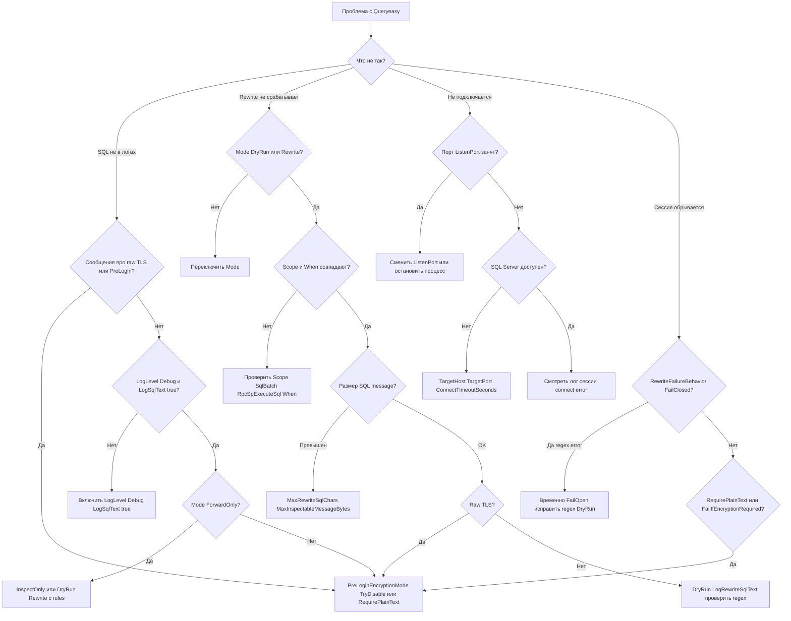

# Troubleshooting

> **Для кого:** оператор  
> **Время чтения:** ~8 мин  
> **Что узнаете:** как диагностировать типичные проблемы с прокси, логами и rewrite.

## Decision tree

---

## Порт прокси уже занят

**Симптом:** ошибка bind на `ListenPort`.

**Проверка:** другой процесс слушает тот же порт.

**Решение:** измените `ListenPort` в конфигурации или остановите конфликтующий процесс.

---

## SQL Server недоступен

**Симптом:** клиент не подключается; в логе сессии ошибка connect к target.

**Проверка:** `TargetHost`, `TargetPort`, сеть, firewall, `ConnectTimeoutSeconds`.

**Решение:** убедитесь, что SQL Server принимает TCP на указанном адресе; увеличьте таймаут при медленной сети.

---

## SQL не появляется в логах

**Наиболее частая причина:** соединение перешло на **TLS**.

**Проверка:** сообщения про PreLogin ENCRYPTION и raw TLS; метрика `raw_tls_fallbacks` в summary.

**Решение:**

- `PreLoginEncryptionMode: "TryDisable"` для попытки plaintext.
- `RequirePlainText` + `FailIfEncryptionRequired: true` для строгого запрета TLS.
- `LogLevel: "Debug"`, `LogSqlText: true`, `Mode` не `ForwardOnly`.

Подробнее: [encryption-and-prelogin.md](encryption-and-prelogin.md).

---

## Rewrite-правило не срабатывает

**Проверьте по порядку:**

1. `Mode` — `DryRun` или `Rewrite`.
2. Правило: `Enabled: true`, непустой legacy `Find` или заполнены `When` и `Actions`.
3. `Scope` соответствует сообщению: `SqlBatch` или `RpcSpExecuteSql`.
4. Для RPC: filter в `When` (`ParameterExists`, `ParameterNameRegex`, `ParameterType`) совпадает с `@params`; в `Actions[].Name` имя указано или опущено для matched parameters.
5. Регистр и пробелы — или `IgnoreCase: true`.
6. SQL не длиннее `MaxRewriteSqlChars`; TDS message не больше `MaxInspectableMessageBytes`.
7. Соединение не ушло в raw TLS.

**Диагностика:** `DryRun` + `LogRewriteSqlText: true` + `LogLevel: Debug`.

---

## Regex-правило завершает сессию

**Симптом:** сессия обрывается после запроса с regex.

**Причина:** `RewriteFailureBehavior: "FailClosed"` и ошибка regex (или таймаут 1 с).

**Решение:** временно `FailOpen`, исправьте выражение, проверьте в `DryRun`.

---

## Альтернативный конфиг не найден после publish

**Симптом:** файл `appsettings.PassThrough.json` не рядом с exe.

**Причина:** копируются только `appsettings.json` и `appsettings.Production.json`.

**Решение:** передайте полный путь аргументом, скопируйте файл вручную или добавьте `CopyToOutputDirectory` в `.csproj`.

---

## Load harness не проверяет RPC rewrite

Скрипт [load-harness.ps1](../tools/load-harness.ps1) выполняет SQL Batch (`ExecuteScalar`). Для правил `RpcSpExecuteSql` нужен реальный клиент с `sp_executesql` (например, 1С).

## См. также

- [Режимы работы](operating-modes.md)
- [Правила rewrite](rewrite-rules.md)
- [Логирование и метрики](logging-and-metrics.md)
